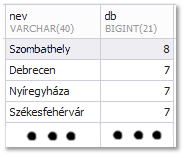
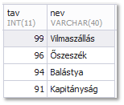

# DBProjekt

## Adatbázis táblák:

### allomas(id, nev, tipus, orszag, mukodo)
| azonosító | típus       | leírás                                                                                       |
|-----------|-------------|----------------------------------------------------------------------------------------------|
| id        | int(11)     | Az állomás azonosítója (szám), ez a kulcs                                                    |
| nev       | varchar(40) | Az állomás neve (szöveg); a nevek egyediek                                                   |
| tipus     | varchar(40) | Az állomás típusa (szöveg); megmutatja, hogy a vasúti forgalomban milyen szerepet töltött be |
| orszag    | varchar(40) | Az állomás országa (szöveg)                                                                  |
| mukodo    | tinyint(1)  | Az állomás működési állapota (logikai), ha működik, akkor értéke igaz                        |

| id        | A vonal egy helyének azonosítója (szám), ez a kulcs                     |
|-----------|-------------------------------------------------------------------------|
| vonalid   | Annak a vasútvonalnak az azonosítója, ahol a hely található (szöveg)    |
| allomasid | Annak az állomásnak az azonosítója, amelyik az adott helyen van (szám)  |
| tav       | A hely kilométerben mért távolsága a vonal indulási állomásától (szám); |
|           | az indulási állomáshoz tartozó távolság 0 km. Értéke a hely km-re       |
|           | kerekített távolsága                                                    |

## Adatbázis diagram:

## 2. feladat:

  A MÁV 6 hónapra kibérelte a moszkvai vasúállomás 42. peronját.
  Helyezze el ezt az új állomást a következő adatokkal.
  (5000, "Moszkva", "állomás", "RUS",0).

## 3.feladat:

  A moszkvai 42. számú peront működésbe helyeztük.
  Állítsá át az adatbázisban a megfelelő mezőt, hogy ezt jelezze.

## 4. feladat:

  6 hónapos kölcsönzési szerződésünk lejárt.
  Törölje Moszkvát az adatbázisből.

## 5. feladat:

  A feladat elkészítéséhez használt egyik forrás azt írja, hogy „Szeged-Feketehalom” 
  megállóhely sosem létezett. Törölje az **allomas** és a **hely** táblákból a rá vonatkozó adatokat! 
  A feladat megoldásához nem kell lekérdezést készítenie. 

## 6. feladat:
  Készítsen lekérdezést, amely az adatbázisban tárolt adatok alapján megjeleníti a jelenleg 
  Magyarországon kívül található állomások nevét és ország jelét, az állomásnév szerint 
  ábécérendben! 

  

## 7. feladat:
  A 80-as vonal az egyik leghosszabb hazánkban. Készítsen lekérdezést, amely a kiinduló 
  állomástól mért távolság sorrendjében megjeleníti a működő állomások nevét, típusát és az 
  indulási állomástól mért távolságát!

  

## 8. feladat:
  Készítsen lekérdezést, amely megadja az egyes vonalak hosszát, azaz az első és az utolsó 
  hely távolságát! Jelenítse meg a vonal azonosítóját és a hossz értékét!

  

## 9. feladat:

## 10. feladat:
  Készítsen lekérdezést, amely megadja, hogy Hatvan mely állomásokról érhető el jelenleg 
  vagy a múltban valamikor közvetlenül, azaz átszállás nélkül! Az állomás nevét és a vonal 
  azonosítóját jelenítse meg! Hatvan neve ne szerepeljen a listában!
  
  

## 11. feladat:
  Készítsen lekérdezést, amely megadja, hogy melyik állomás része legalább 5 
  vasútvonalnak! Az állomás nevét és a vonalak számát jelenítse meg darabszám szerint 
  csökkenő sorrendben!

  
  
## 12. feladat:
  Napjainkban két állomás közötti jegyet kell váltani, de régebben a jegy egy adott 
  távolságintervallumon volt érvényes: 5, 10, 20, …, 90, 100, … km-es jegyeket lehetett 
  venni. Ha valaki 100 km távolságra szóló jegyet vett, akkor bizonyára távolabb utazott, mint 
  90 km (mert az volt az azt közvetlenül megelőző, 100 km-nél rövidebb távra szóló jegy), 
  de a 100 km-t nem léphette túl. Készítsen lekérdezést, amelyik megadja, hogy a 140-es 
  vonal indulási állomásától hova utazhatott az, aki 100 km-es jegyet vett! Adja meg az 
  állomások nevét és a távolságát!

  
